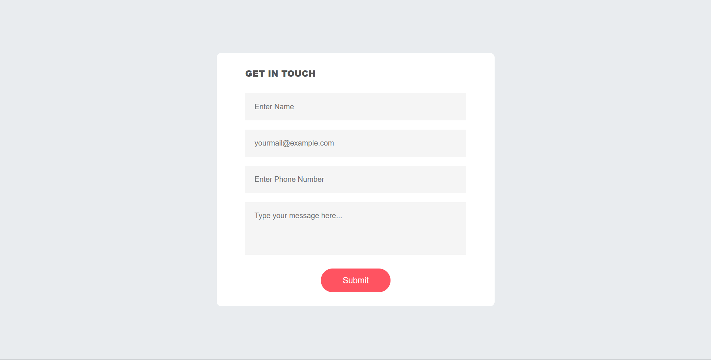

# Contact Form

### Project Description:

Designed and developed a responsive contact form using `<HTML>`, `<CSS>`, and `<JavaScript>` that allows users to submit their name, email, and message. Implemented `<SMTP API>` to send emails to a specified recipient.

### Features

- Responsive design for mobile and desktop devices
- Validation for name, email, and message fields
- Submission via SMTP API using SMTP service

### Key Features:

- Responsive design for mobile and desktop devices
- Validation for name, email, and message fields
- Submission via SMTP API

### Technical Skills Used:

- HTML5
- CSS3
- JavaScript (ES6)
- SMTP API

### Achievements:

- Successfully implemented SMTP API to send emails
- Created a responsive design that works on various devices
- Implemented form validation to ensure accurate user input
- Wrote clean and modular code for easy maintenance
